[README.md](https://github.com/user-attachments/files/28673585/README.md)
# Wafferha — Anas Alsubaie's Modules

> AI coaching, savings goals, financial progress, engagement loops and notifications for a gamified Saudi savings app.

## Overview

Wafferha is a gamified-savings feature for a Saudi bank app (a Capstone 3 project). Users link their bank via Tarabut Open Banking, get AI-generated saving tasks, earn points, set savings goals, and compete on a FAIRNESS leaderboard ranked on the percentage of their own income they save (capped at 40%) — never absolute wealth. It is Shariah-compliant with zero randomness.

## My area: AI Coaching, Goals, Engagement & Notifications

This subsystem is the user's day-to-day coach. It serves the **AI financial-literacy questions** and **behaviour-based insight nudges**, manages **savings goals** (including the AI-suggested goal at 40% of income), **inflation-buffered plans** and **financial progress**, and exposes the **SAMA economic context** that grounds those plans. It also runs the **engagement loop** — challenges and streaks — and all **notifications**, including payday scheduling, task reminders, and the inbound **WhatsApp webhook** that turns goal-adjust and daily-question replies into action.

## System class diagram

This diagram describes the **whole Wafferha system** (28 entities) and is shared across the team; the modules documented in this README are Anas's.

```mermaid
classDiagram
    class User {
        Integer id
        String name
        String phoneNumber
        String email
        Integer paydayDay
        Integer monthlyIncome
        boolean competitiveOptIn
        boolean phoneVerified
        boolean bankVerified
        String integrityStatus
        League league
    }
    class Admin {
        Integer id
        String name
        String email
    }
    class League {
        Integer id
        String segmentType
        String name
        String displayName
        Set~User~ users
    }
    class Season {
        Integer id
        String seasonType
        String name
        String theme
        Integer year
        String status
        Set~Item~ items
        Set~Challenge~ challenges
    }
    class Wallet {
        Integer id
        Integer userId
        int year
        int pointsBalance
        int earnedThisYear
        int spentThisYear
        int expiredPoints
        String status
    }
    class SeasonalWallet {
        Integer id
        Integer userId
        Integer seasonId
        int seasonalPointsBalance
        int earnedDuringSeason
        int spentDuringSeason
        int expiredPoints
        String status
    }
    class PointsLedger {
        Integer id
        Integer userId
        Integer walletId
        int year
        int amount
        String reason
        Integer refId
    }
    class SeasonalPointsLedger {
        Integer id
        Integer userId
        Integer seasonId
        Integer seasonalWalletId
        int amount
        String reason
        Integer refId
    }
    class BehaviorSource {
        Integer id
        Integer userId
        String type
        boolean primary
        boolean salaryDetected
    }
    class BehaviorEvent {
        Integer id
        Integer sourceId
        Integer userId
        BigDecimal value
        String category
        String direction
    }
    class BaselineIncome {
        Integer id
        Integer userId
        int windowDays
        BigDecimal baselineIncomeValue
        BigDecimal floorValue
    }
    class Score {
        Integer id
        Integer userId
        String period
        BigDecimal rateSubscore
        BigDecimal consistencySubscore
        BigDecimal improvementSubscore
        BigDecimal compositeScore
        BigDecimal percentileInLeague
    }
    class FinancialProgress {
        Integer id
        Integer userId
        BigDecimal totalSaved
        LocalDate projectedGoalDate
        BigDecimal emergencyFundPct
    }
    class Insight {
        Integer id
        Integer userId
        String message
        String type
    }
    class DailyQuestion {
        Integer id
        Integer userId
        String question
        String options
        String correctAnswer
        String explanation
        int rewardPoints
        LocalDate questionDate
        boolean answered
        boolean answeredCorrectly
    }
    class SavingsGoal {
        Integer id
        Integer userId
        String name
        Double targetAmount
        Double bufferedTarget
        String bufferRationale
        Double perPeriodAmount
        String cadence
        LocalDate targetDate
        Double savedAmount
        String status
    }
    class PersonalizedGoal {
        Integer id
        String period
        String status
        Double suggestedTarget
        String rationale
        String modelVersion
        User user
    }
    class PendingGoalAdjustment {
        Integer id
        Integer userId
        Integer savingsGoalId
        String phoneNumber
        boolean resolved
    }
    class Challenge {
        Integer id
        String title
        String cadence
        String type
        Double targetValue
        Integer rewardPoints
        String rewardCurrencyType
        Season season
        Item rewardItem
        Set~UserChallenge~ userChallenges
    }
    class UserChallenge {
        Integer id
        Double progress
        String status
        LocalDateTime completedAt
        User user
        Challenge challenge
    }
    class Item {
        Integer id
        String name
        String type
        Integer cost
        String currencyType
        String rarity
        Boolean isSeasonExclusive
        Boolean awardOnly
        String unlockCondition
        String couponCode
        String couponDescription
        Season season
        Set~UserReward~ userRewards
    }
    class UserReward {
        Integer id
        String sourceType
        String purchaseCurrency
        Boolean equipped
        Boolean redeemed
        User user
        Item item
        Season season
    }
    class IntegrityFlag {
        Integer id
        Boolean salaryVerified
        String anomalyFlags
        Boolean competitiveEligible
        LocalDate eligibleSince
        User user
    }
    class LeaderBoard {
        Integer id
        String period
        LocalDateTime snapshotAt
        League league
        Set~LeaderBoardEntry~ entries
    }
    class LeaderBoardEntry {
        Integer id
        Integer rank
        Double score
        User user
        LeaderBoard leaderboard
    }
    class EconomicContext {
        Integer id
        Double inflationRatePct
        Double policyRatePct
        String seasonLevel
        String savingClimate
        String source
    }
    class VerificationCode {
        Integer id
        Integer userId
        String code
        LocalDateTime expiresAt
        boolean used
    }
    User --> League : league
    League --> User : users
    Season --> Item : items
    Season --> Challenge : challenges
    Challenge --> Season : season
    Challenge --> Item : rewardItem
    Challenge --> UserChallenge : userChallenges
    UserChallenge --> User : user
    UserChallenge --> Challenge : challenge
    Item --> Season : season
    Item --> UserReward : userRewards
    UserReward --> User : user
    UserReward --> Item : item
    UserReward --> Season : season
    IntegrityFlag --> User : user
    PersonalizedGoal --> User : user
    LeaderBoard --> League : league
    LeaderBoard --> LeaderBoardEntry : entries
    LeaderBoardEntry --> User : user
    LeaderBoardEntry --> LeaderBoard : leaderboard
    Wallet ..> User : userId
    SeasonalWallet ..> User : userId
    SeasonalWallet ..> Season : seasonId
    PointsLedger ..> User : userId
    PointsLedger ..> Wallet : walletId
    SeasonalPointsLedger ..> User : userId
    SeasonalPointsLedger ..> Season : seasonId
    SeasonalPointsLedger ..> SeasonalWallet : seasonalWalletId
    BehaviorSource ..> User : userId
    BehaviorEvent ..> User : userId
    BehaviorEvent ..> BehaviorSource : sourceId
    BaselineIncome ..> User : userId
    Score ..> User : userId
    FinancialProgress ..> User : userId
    Insight ..> User : userId
    DailyQuestion ..> User : userId
    SavingsGoal ..> User : userId
    PendingGoalAdjustment ..> User : userId
    PendingGoalAdjustment ..> SavingsGoal : savingsGoalId
    VerificationCode ..> User : userId
```



## AI in Wafferha

Wafferha uses **OpenAI (gpt-5.5)** through the Responses API with strict JSON-schema structured output. The AI:
- generates **personalised saving tasks** from the user's real spending,
- writes the **daily 60-second financial-literacy questions** (with the correct answer + explanation),
- produces behaviour-based **saving nudges (insights)**,
- phrases the **AI 40%-goal rationale** and the **behind-on-goal** WhatsApp nudge.

Points are always awarded by **our** code, never by the model. Every AI feature has a **deterministic fallback**, so the app keeps working — and stays Shariah-compliant, plain-language and jargon-free — even when the model is off.

### Measured AI accuracy — 50 live runs (gpt-5.5)

We fed **50 varied spending datasets** (different incomes and spending categories) to the saving-task generator and checked every output programmatically:

| Metric | Result |
|---|---|
| Valid, in-spec task | **50 / 50 (100%)** |
| Plain language — no jargon / riba | **50 / 50 (100%)** |
| Sensible target (≤ 50% of income) | **50 / 50 (100%)** |
| Genuine AI answer (not a fallback) | **49 / 50 (98%)** |
| Consistent "save"-type task | **49 / 50 (98%)** |

Reproduce it: `mvn test -Dtest=AiAccuracyTest -Dai.accuracy=true -Dopenai.enabled=true` (see `src/test/java/com/wafferha/AiAccuracyTest.java`).

## My endpoints

### AI coaching (my AI method) — `/api/v1/ai`

These are built via OpenAI (gpt-5.5, strict JSON) with a deterministic fallback.

| Method | Path | What it does |
| --- | --- | --- |
| POST | `/api/v1/ai/daily-question/{userId}` | Generate today's AI 60-second financial-literacy question. |
| POST | `/api/v1/ai/daily-question/{dailyQuestionId}/answer` | Answer the daily question (correct → points). |
| POST | `/api/v1/ai/insights/{userId}/generate` | Generate a behaviour-based AI saving nudge (Insight). |

### Daily questions (reads) — `/api/v1/daily-questions`

| Method | Path | What it does |
| --- | --- | --- |
| GET | `/api/v1/daily-questions` | All. |
| GET | `/api/v1/daily-questions/{id}` | One. |
| GET | `/api/v1/daily-questions/user/{userId}` | A user's questions. |
| GET | `/api/v1/daily-questions/user/{userId}/filter` | Filtered. |

### Insights (reads) — `/api/v1/insights`

| Method | Path | What it does |
| --- | --- | --- |
| GET | `/api/v1/insights` | All. |
| GET | `/api/v1/insights/{id}` | One. |
| GET | `/api/v1/insights/user/{userId}` | A user's insights. |
| GET | `/api/v1/insights/user/{userId}/filter` | Filter by type. |

### AI personalized goal — `/api/v1/personalized-goal`

| Method | Path | What it does |
| --- | --- | --- |
| POST | `/api/v1/personalized-goal/generate/{userId}` | AI suggests a goal at 40% of income, with a rationale. |
| GET | `/api/v1/personalized-goal/get` | All suggested goals. |
| GET | `/api/v1/personalized-goal/user/{userId}` | A user's suggested goals. |
| POST | `/api/v1/personalized-goal/{id}/accept` | Accept a suggested goal. |
| POST | `/api/v1/personalized-goal/add/{userId}` | Manually add a personalized goal. |

### Savings goals — `/api/v1/savings-goals`

| Method | Path | What it does |
| --- | --- | --- |
| POST | `/api/v1/savings-goals/{userId}` | Create a goal + inflation-buffered plan. |
| GET | `/api/v1/savings-goals/{userId}` | A user's goals. |
| GET | `/api/v1/savings-goals/user/{userId}/filter` | Filtered. |
| POST | `/api/v1/savings-goals/{goalId}/recalculate` | Recompute the plan. |
| POST | `/api/v1/savings-goals/{goalId}/progress` | Record progress. |
| POST | `/api/v1/savings-goals/{goalId}/check-behind` | Check if behind pace. |
| POST | `/api/v1/savings-goals/{goalId}/simulate-behind` | Demo trigger that forces the goal behind now. |
| POST | `/api/v1/savings-goals/{goalId}/adjust/{choice}` | Apply choice 1 (extend) or 2 (redistribute). |

### Financial progress — `/api/v1/financial-progress`

| Method | Path | What it does |
| --- | --- | --- |
| POST | `/api/v1/financial-progress/recompute/{userId}` | Recompute the saved total & improvement. |
| GET | `/api/v1/financial-progress` | All. |
| GET | `/api/v1/financial-progress/{id}` | One. |
| GET | `/api/v1/financial-progress/user/{userId}` | A user's progress. |

### Economic context (SAMA) — `/api/v1/economic-context`

| Method | Path | What it does |
| --- | --- | --- |
| GET | `/api/v1/economic-context` | Current macro backdrop. |
| PUT | `/api/v1/economic-context` | Update the macro backdrop. |

### Engagement: challenges — `/api/v1/user-challenge`

| Method | Path | What it does |
| --- | --- | --- |
| GET | `/api/v1/user-challenge/get` | All user-challenges. |
| GET | `/api/v1/user-challenge/user/{userId}` | A user's challenges. |
| GET | `/api/v1/user-challenge/user/{userId}/filter` | Filtered. |
| PUT | `/api/v1/user-challenge/{id}/progress` | Advance progress (query param amount). |
| POST | `/api/v1/user-challenge/add/{userId}/{challengeId}` | Join a challenge. |

### Challenge catalog — `/api/v1/challenge`

| Method | Path | What it does |
| --- | --- | --- |
| GET | `/api/v1/challenge/get` | All challenges. |
| GET | `/api/v1/challenge/season/{seasonId}` | Challenges in a season. |
| GET | `/api/v1/challenge/active` | Currently active challenges. |
| POST | `/api/v1/challenge/add/{seasonId}/{itemId}/{adminId}` | Create a challenge (admin-gated). |

### Streaks — `/api/v1/streaks`

| Method | Path | What it does |
| --- | --- | --- |
| POST | `/api/v1/streaks/record/{userId}/{type}` | Record a streak event of a type. |
| GET | `/api/v1/streaks` | All streaks. |
| GET | `/api/v1/streaks/{id}` | One streak. |
| GET | `/api/v1/streaks/user/{userId}` | A user's streaks. |
| PUT | `/api/v1/streaks/{id}/use-freeze` | Spend a streak freeze. |

### Notifications — `/api/v1/notifications`

| Method | Path | What it does |
| --- | --- | --- |
| POST | `/api/v1/notifications/encourage/{userId}` | Send an encouragement nudge (email + WhatsApp). |
| POST | `/api/v1/notifications/account-verified/{userId}` | Send the "account verified" email. |

### Scheduled task reminders — `/api/v1/notifications/tasks`

| Method | Path | What it does |
| --- | --- | --- |
| POST | `/api/v1/notifications/tasks/{cadence}` | Send task reminders for a cadence to all users. |
| POST | `/api/v1/notifications/tasks/{cadence}/user/{userId}` | Send a task reminder to one user. |

### Payday tasks (scheduler) — `/api/v1/payday-tasks`

| Method | Path | What it does |
| --- | --- | --- |
| POST | `/api/v1/payday-tasks/run` | Generate payday tasks for users whose payday is that day (query param day). |

### Inbound WhatsApp — `/api/v1/whatsapp`

| Method | Path | What it does |
| --- | --- | --- |
| POST | `/api/v1/whatsapp/twilio` | Twilio inbound webhook: goal-adjust + daily-question replies (returns TwiML). |

## Tech stack

Java 17 · Spring Boot 3.5.14 · Spring Web · Spring Data JPA (Hibernate) · MySQL (only DB, no H2) · Lombok · Maven · OpenAI · Tarabut Gateway · Twilio · Mailtrap

## Run it

```bash
# Smoke test - boots the full Spring context on a local MySQL
mvn -B clean test

# Run the app (needs MySQL on localhost:3306, db `wafferha`, user `root`)
mvn spring-boot:run
```

- Base URL: `http://localhost:8080`
- A ready-to-run Postman collection lives at `postman/Wafferha-Demo-Journey.postman_collection.json`.

## Team

Capstone 3 — built by:

- Anas Alsubaie
- Walaa Alrashidi
- Bayan Alkayyal

The modules documented in this README belong to **Anas Alsubaie**.
